```mermaid
flowchart TD
    subgraph xli_path["xli path (Rust) — codex-rs/core/src/"]
        direction TB

        XU["UserInput\n(text / tool result / image)"]

        XBP["build_prompt()\ncodex.rs / prompt_debug.rs\nReturns Prompt { input: Vec&lt;ResponseItem&gt;, tools, base_instructions }"]

        XRI["ResponseItem[]\nOpenAI Responses API enum:\n• Message { role, content: Vec&lt;ContentItem&gt; }\n• FunctionCall { call_id, name, arguments }\n• FunctionCallOutput { call_id, output }\n• LocalShellCall { call_id, action }\n• Reasoning { content, encrypted_content, raw_wire_block }\n• CustomToolCall / CustomToolCallOutput\n• ToolSearchCall / ToolSearchOutput"]

        XEW["effective_wire_api(model_slug)\nclient.rs:1743\nWireApi::Messages for Anthropic models\nWireApi::Responses auto-selected for non-Anthropic"]

        XCO["clean_orphaned_tool_calls(input)\nmessages_wire.rs:19\nS-005: two-pass — collect paired call IDs,\nfilter unpaired tool_use/tool_result"]

        XCAM["conversation_to_anthropic_messages(input, supports_image)\nmessages_wire.rs:89\nTranslates ResponseItem[] → Vec&lt;serde_json::Value&gt;\n\nFunctionCall    → {type:tool_use, id, name, input}\nFunctionCallOutput → {type:tool_result, tool_use_id, content}\nLocalShellCall  → {type:tool_use, name:shell, synthetic id}\nMessage(user)   → {role:user, content:[{type:text, ...}]}\nMessage(asst)   → {role:assistant, content:[...]}\nReasoning       → {type:thinking} or {type:redacted_thinking}\n                   (raw_wire_block preferred for byte-identical replay)\nImage           → {type:image, source:{url}} or text placeholder S-008\n\nstrip_thinking_from_non_latest_assistant_messages()\nS-014 Vertex AI guard: append [Continue] if trailing assistant"]

        XDEV["extract_developer_blocks(input)\nmessages_wire.rs:404\nDeveloper-role ResponseItems → system[] text blocks\n(AGENTS.md, permission directives, personality config)"]

        XSYS["Build system[] parameter\nclient.rs:1350-1376\n[base_instructions_text_block,\n developer_block_1, ...,\n last_block + cache_control:{type:ephemeral}]"]

        XREQ["MessagesApiRequest\nclient.rs:1398\n{ model, messages, max_tokens, stream:true,\n  system, tools, tool_choice, thinking,\n  temperature, top_p, top_k }"]

        XHTTP["POST /v1/messages\nApiMessagesClient.stream_request()\ncodex-api/src/endpoint/messages.rs\nReqwestTransport + SSE\nExtra headers: x-codex-turn-metadata"]

        XSSE["Anthropic SSE response stream"]

        XPARSE["SSE parser\ncodex-api/src/sse/messages.rs\ncontent_block_start → BlockTracker entry\ncontent_block_delta (text_delta / input_json_delta) → accumulate\ncontent_block_stop → emit ResponseEvent\nmessage_delta (stop_reason) → emit Completed\nmessage_start (usage) → emit TokenUsage"]

        XRE["ResponseEvent stream\nclient_common.rs\n• TextDelta { text }\n• FunctionCallDelta { call_id, name, arguments }\n• Completed { response_id, usage }\n• RateLimitSnapshot\n→ mpsc channel → Session"]

        XRL["Record in history\nContextManager.record_items()\nstate/session.rs:71\nTruncationPolicy applied"]

        XLD["LoopDetector checks\nloop_detection.rs\nrecord_tool_call(name, args) → threshold=5\nrecord_content(text) → threshold=10\nhash_string() → DefaultHasher\nLoop → inject LOOP_BREAK_MESSAGE, reset()"]

        XU --> XBP
        XBP --> XRI
        XRI --> XEW
        XEW -->|WireApi::Messages| XCO
        XCO --> XCAM
        XCAM --> XDEV
        XDEV --> XSYS
        XSYS --> XREQ
        XREQ --> XHTTP
        XHTTP --> XSSE
        XSSE --> XPARSE
        XPARSE --> XRE
        XRE --> XRL
        XRL --> XLD
        XLD -->|tool result pending| XBP
        XLD -->|turn complete| XU
    end

    subgraph qwencode_path["qwen-code path (TypeScript) — packages/core/src/core/"]
        direction TB

        QU["UserInput (text / tool result)"]

        QGC["GeminiClient.sendMessageStream(request, signal)\nclient.ts"]

        QT["Turn.run()\nturn.ts\nOrchestrates one complete agent turn"]

        QCH["GeminiChat.sendMessageStream(userTurn, config)\ngeminiChat.ts\nhistory: Content[] maintained on class\nAppends Content { role, parts: Part[] }"]

        QACC["AnthropicContentConverter\n.convertGeminiRequestToAnthropic()\nanthropicContentGenerator/converter.ts\n\nContent[] (Gemini format) →\n Anthropic messages[]\n\nTextPart        → text block\nFunctionCallPart → tool_use block\nFunctionResponse → tool_result block"]

        QREQ["Anthropic MessagesRequest\n(cleanOrphanedToolCalls() applied\nin openaiContentGenerator/converter.ts)"]

        QHTTP["POST /v1/messages\nAnthropicContentGenerator"]

        QSSE["Anthropic SSE response stream"]

        QPARSE["SSE → GenerateContentResponse\nasync generator (yield)\ngeminiChat.ts processStreamResponse()"]

        QRE["Content[] accumulated\ngeminiChat.history updated"]

        QU --> QGC
        QGC --> QT
        QT --> QCH
        QCH --> QACC
        QACC --> QREQ
        QREQ --> QHTTP
        QHTTP --> QSSE
        QSSE --> QPARSE
        QPARSE --> QRE
        QRE -->|tool call pending| QT
        QRE -->|turn complete| QU
    end

    subgraph apexontap_path["apex-ontap path (TypeScript) — same engine as qwen-code"]
        direction TB

        AU["UserInput"]

        AGC["GeminiClient (same as qwen-code)"]

        ADIFF["Differences from qwen-code:\n• ONTAP-specific skills\n  (deploy/skills/ontap-dev-guide/)\n• ONTAP-specific prompts / persona\n• Same converter.ts, same wire path\n• No engine-level differences"]

        AHTTP["POST /v1/messages\n(same as qwen-code)"]

        AU --> AGC --> ADIFF --> AHTTP
    end

    XHTTP -.->|"Anthropic Claude API"| AnthropicAPI[("Anthropic\nClaude API\n/v1/messages")]
    QHTTP -.->|"Anthropic Claude API"| AnthropicAPI
    AHTTP -.->|"Anthropic Claude API"| AnthropicAPI
    AnthropicAPI -.->|SSE stream| XSSE
    AnthropicAPI -.->|SSE stream| QSSE
    AnthropicAPI -.->|SSE stream| ADIFF
```

# Data Flow: Message Through All Three Repos (Anthropic Target)

Single Mermaid flowchart showing the complete data transformation chain for a
user message going through xli, qwen-code, and apex-ontap when targeting the
Anthropic Claude API.

xli is the focal point and receives the most detail because it is the primary
subject of this documentation set.

---



---

## Key Data Transformation Points

### xli: `ResponseItem` → Anthropic Wire JSON

The xli path is distinctive because the internal format (`ResponseItem`) is the
**OpenAI Responses API enum** — not a Gemini-format intermediate. The conversion
to Anthropic JSON happens in a single function at wire time:

```
ResponseItem::FunctionCall { call_id, name, arguments }
  → {"type":"tool_use","id":call_id,"name":name,"input":<parsed arguments>}
  [messages_wire.rs:150-167]

ResponseItem::FunctionCallOutput { call_id, output }
  → {"type":"tool_result","tool_use_id":call_id,"content":<content>}
  [messages_wire.rs:169-179]

ResponseItem::Message { role:"assistant", content:[OutputText{text}] }
  → {"role":"assistant","content":[{"type":"text","text":text}]}
  [messages_wire.rs:98-147]

ResponseItem::Reasoning { raw_wire_block, encrypted_content, ... }
  → {"type":"thinking","thinking":text,"signature":sig}
  OR {"type":"redacted_thinking","data":data}
  (prefers raw_wire_block for byte-identical cryptographic replay)
  [messages_wire.rs:237-303]
```

### qwen-code / apex-ontap: `Content[]` → Anthropic Wire JSON

The TypeScript path carries the Gemini `Content { role, parts: Part[] }` format
through the entire turn lifecycle. Conversion to Anthropic JSON happens in
`AnthropicContentConverter.convertGeminiRequestToAnthropic()`. The internal
format is never in `ResponseItem` form — it is always Gemini-native `Content[]`.

### Response Path: Anthropic SSE → Internal Format

| Repo | SSE Parser | Output |
|---|---|---|
| xli | `codex-api/src/sse/messages.rs` — `BlockTracker` accumulates `content_block_*` events into `ResponseEvent`s delivered via `mpsc` channel | `ResponseEvent` stream → `ResponseItem[]` in history |
| qwen-code / apex-ontap | `processStreamResponse()` in `geminiChat.ts` — `AsyncGenerator` yielding `GenerateContentResponse` | `Content[]` appended to `GeminiChat.history` |

### S-014: Vertex AI Guard (xli only)

When the Anthropic proxy routes through Vertex AI, trailing assistant messages
cause a 400 rejection ("model does not support assistant message prefill").
xli appends a synthetic user sentinel unconditionally:
- Has pending `tool_use`: `[Awaiting tool result]`
- Otherwise: `[Continue]`

Source: `codex-rs/core/src/messages_wire.rs:359-388`

This guard is not present in qwen-code or apex-ontap.

### Cache Control (xli only)

xli places `cache_control: {type: ephemeral}` on the **last** system block so
Anthropic caches all static content (base instructions + developer blocks) across
turns. Source: `codex-rs/core/src/client.rs:1364-1370`.

This optimisation is not present in qwen-code or apex-ontap.
