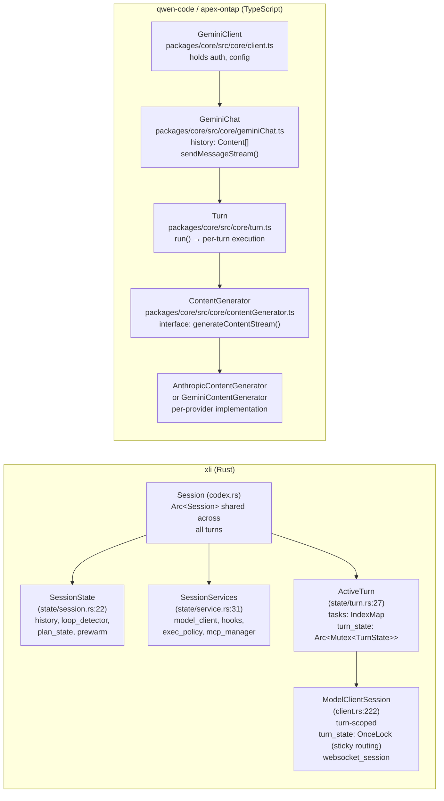

# Turn Lifecycle Comparison: xli vs qwen-code / apex-ontap

Structural comparison of how a single user turn is processed across the three
codebases. xli is a Rust fork of OpenAI Codex; qwen-code and apex-ontap are
TypeScript forks of Gemini CLI. These are fundamentally different architectures.

---

## Mermaid Sequence Diagram: Fundamental Architecture Difference

```mermaid
sequenceDiagram
    box xli (Rust)
        participant U1 as UserInput
        participant S1 as Session (codex.rs)
        participant BP as build_prompt()
        participant MC as ModelClient
        participant MW as messages_wire.rs
        participant RI as ResponseItem[]
        participant W1 as Wire JSON
    end

    box qwen-code / apex-ontap (TypeScript)
        participant U2 as UserInput
        participant GC as GeminiClient
        participant TN as Turn.run()
        participant CH as GeminiChat
        participant CG as ContentGenerator
        participant CO as Content[]
        participant W2 as Wire JSON
    end

    Note over U1,W1: xli path — direct ResponseItem serialization

    U1->>S1: submit text / tool result
    S1->>BP: build_prompt(items, tools, turn_context, base_instructions)
    BP-->>MC: Prompt { input: Vec&lt;ResponseItem&gt;, tools, base_instructions }
    MC->>MC: effective_wire_api(slug) → WireApi::Messages or Responses
    alt WireApi::Messages
        MC->>MW: conversation_to_anthropic_messages(input, supports_image)
        MW->>MW: clean_orphaned_tool_calls()
        MW-->>W1: Vec&lt;serde_json::Value&gt; messages
    else WireApi::Responses
        MC-->>W1: ResponsesApiRequest (native ResponseItem serialization)
    end
    W1->>MC: SSE → ResponseEvent stream (mpsc channels)
    MC-->>S1: ResponseItem[] accumulated

    Note over U2,W2: qwen-code / apex-ontap path — Content[] through ContentGenerator

    U2->>GC: sendMessageStream(request, signal)
    GC->>TN: new Turn(client, request, ...).run()
    TN->>CH: GeminiChat.sendMessageStream(userTurn, config)
    CH->>CH: history: Content[] maintained on class
    CH->>CG: ContentGenerator.generateContentStream(request)
    alt GeminiContentGenerator
        CG-->>W2: Gemini /generateContent JSON
    else AnthropicContentGenerator
        CG->>CG: AnthropicContentConverter.convertGeminiRequestToAnthropic()
        CG-->>W2: Anthropic /messages JSON
    end
    W2->>CG: SSE → AsyncGenerator&lt;GenerateContentResponse&gt;
    CG-->>CH: Content[] accumulated
    CH-->>TN: Turn complete
    TN-->>GC: GenerateContentResponse
```

---

## Key Divergence Table

| Aspect | xli (Rust) | qwen-code / apex-ontap (TypeScript) |
|---|---|---|
| **Language / runtime** | Rust, Tokio async | TypeScript, Node.js |
| **Internal message format** | `ResponseItem` enum (`codex-rs/core/src/client.rs:74`) | `Content { role, parts: Part[] }` (Gemini native format) |
| **History manager** | `ContextManager` (`state/session.rs:24`) — session-scoped struct holding `Vec<ResponseItem>` | `GeminiChat.history: Content[]` — class field on `GeminiChat` |
| **Provider abstraction** | `ModelClient` + direct wire serialization (`client.rs:205`) | `ContentGenerator` interface + per-provider implementations |
| **Anthropic conversion** | `conversation_to_anthropic_messages()` in `messages_wire.rs:89` — translates `ResponseItem[]` → Anthropic JSON | `AnthropicContentConverter.convertGeminiRequestToAnthropic()` — translates `Content[]` → Anthropic JSON |
| **Orphaned tool call cleanup** | `clean_orphaned_tool_calls()` in `messages_wire.rs:19` (S-005) | `cleanOrphanedToolCalls()` in `openaiContentGenerator/converter.ts` (qwen-code origin, ported to xli) |
| **Loop detection** | `LoopDetector` ring buffers (`loop_detection.rs`) — hash-based, VecDeque, configurable thresholds | `LoopDetectionService` — event-based, different detection strategy |
| **Sandbox** | Landlock (Linux) / Seatbelt (macOS) via `codex-rs/exec` (`landlock.rs:25`, `seatbelt.rs`) | In-process tool execution, no OS-level sandboxing |
| **Session state** | `SessionState` + `SessionServices` structs (`state/session.rs`, `state/service.rs`) | `GeminiClient` + `GeminiChat` classes |
| **Concurrency model** | Tokio async + `mpsc` channels for event delivery | Node.js `AsyncGenerator` / `yield` |
| **Startup optimization** | WebSocket prewarm (`SessionStartupPrewarmHandle`, `session_startup_prewarm.rs:22`) | None |
| **Turn routing** | Sticky routing via `x-codex-turn-state` header (`client.rs:133`, `client.rs:235`) | None |
| **Tool execution manager** | `UnifiedExecProcessManager` (`unified_exec/mod.rs:125`) — process manager with streaming output | Direct async function call |
| **Approval flow** | `ApprovalStore` + `ExecPolicyManager` (`tools/sandboxing.rs:40`, `exec_policy.rs`) | Per-tool approval checks |
| **Image modality gating** | `supports_image` flag in `conversation_to_anthropic_messages()` (`messages_wire.rs:117`) — text placeholder for unsupported models (S-008) | Separate modality checks per generator |
| **Developer role injection** | `extract_developer_blocks()` (`messages_wire.rs:404`) → system[] parameter | Inline system prompt construction |
| **Reasoning / thinking** | `anthropic_thinking_param()` (`client.rs` ~2110), raw_wire_block for byte-identical replay (`messages_wire.rs:251`) | Separate thinking config per generator |
| **Vertex AI guard** | S-014: synthetic user sentinel when conversation ends on assistant role (`messages_wire.rs:359`) | Not present in base engine |

---

## State Machine Comparison



---

## Wire Conversion Comparison

### xli: `conversation_to_anthropic_messages()` (`messages_wire.rs:89`)

```
ResponseItem[]
  ↓ clean_orphaned_tool_calls()          # S-005 — strip unpaired tool_use/tool_result
  ↓ Iterate items
     Message(user/assistant) → text/image content blocks
     FunctionCall            → tool_use {type, id, name, input}
     FunctionCallOutput      → tool_result {type, tool_use_id, content}
     CustomToolCall          → tool_use
     LocalShellCall          → tool_use name=shell (synthetic ID if needed)
     Reasoning               → thinking / redacted_thinking (raw_wire_block preferred)
  ↓ strip_thinking_from_non_latest_assistant_messages()
  ↓ S-014 Vertex AI guard: append [Continue] if trailing assistant
  → Vec<serde_json::Value>
```

### qwen-code / apex-ontap: `AnthropicContentConverter.convertGeminiRequestToAnthropic()`

```
Content[]  (Gemini format: role + Part[])
  ↓ convertGeminiRequestToAnthropic()
     TextPart         → text block
     FunctionCallPart → tool_use block
     FunctionResponse → tool_result block
  → Anthropic MessagesRequest
```

The xli path operates on `ResponseItem` (OpenAI Responses API native enum) and converts
directly to Anthropic wire JSON. The qwen-code/apex-ontap path operates on `Content[]`
(Gemini native format) and converts to Anthropic wire JSON via a separate converter class.
The intermediate formats are different: xli never passes through a Gemini-format representation.
