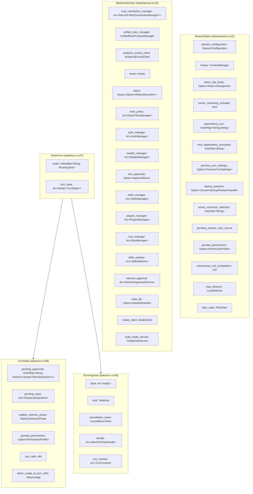
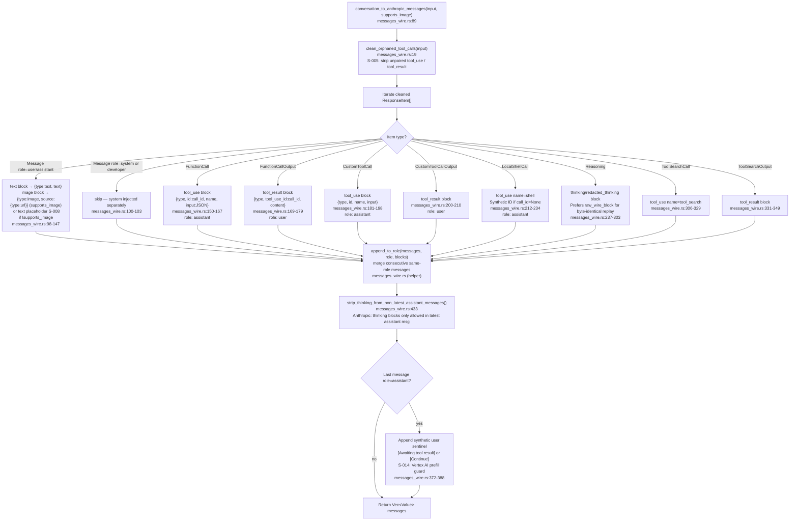
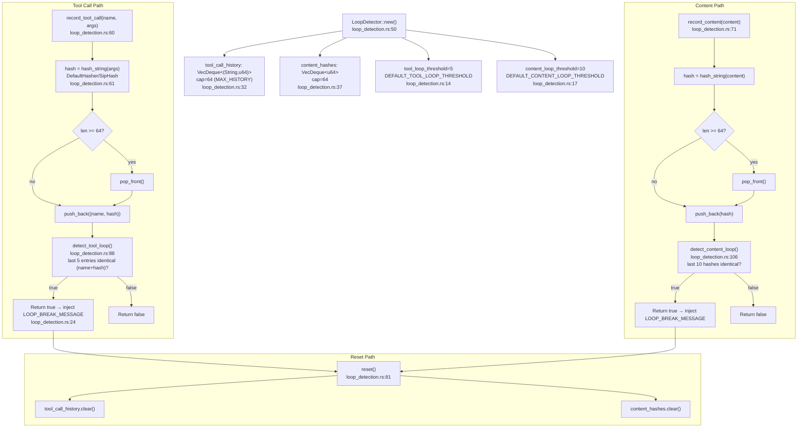
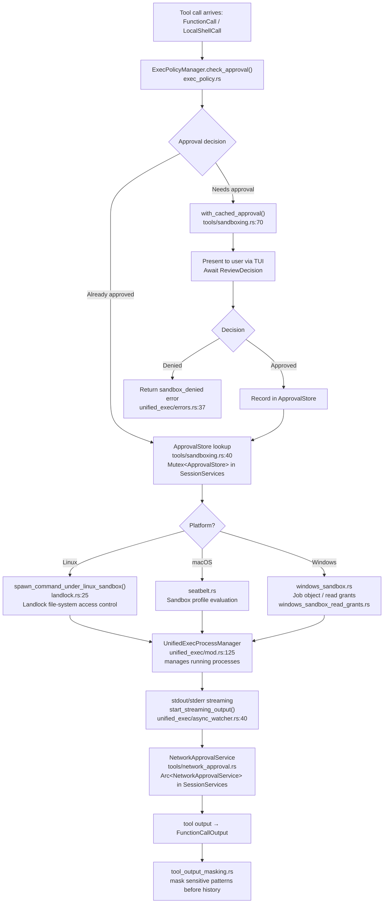
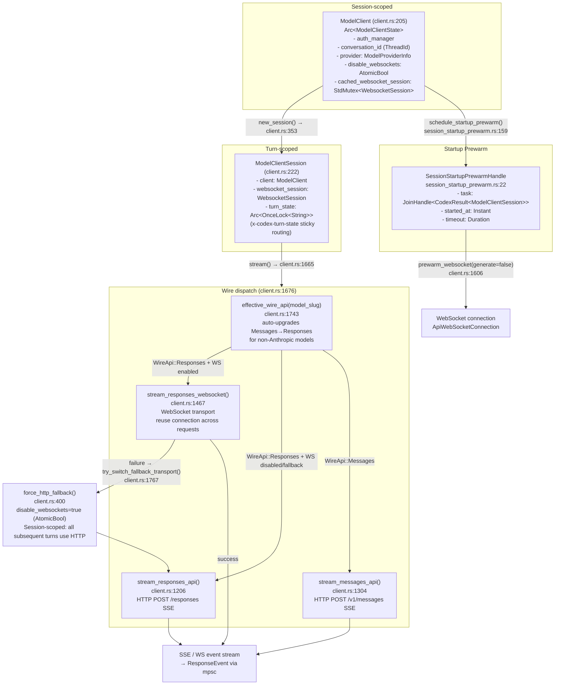

# xli Turn Lifecycle

Visual walkthrough of the complete turn lifecycle in xli (Rust).

---

## Mermaid Sequence Diagram: Full Turn

```mermaid
sequenceDiagram
    participant TUI as TUI (Ratatui)
    participant Session as Session / codex.rs
    participant State as SessionState
    participant Prewarm as SessionStartupPrewarmHandle
    participant Turn as ActiveTurn / TurnState
    participant Prompt as build_prompt()
    participant MCS as ModelClientSession
    participant MC as ModelClient
    participant Wire as Provider Wire (SSE)
    participant Tools as Tool Execution
    participant Loop as LoopDetector
    participant CTX as ContextManager

    TUI->>Session: submit user input
    Note over Session,State: Phase 1 — Session initialization
    Session->>State: SessionState::new(session_configuration)
    State->>State: ContextManager::new() → history
    State->>State: LoopDetector::new() → loop_detector
    Session->>Prewarm: schedule_startup_prewarm(base_instructions)
    Prewarm-->>MC: model_client.new_session() → ModelClientSession
    Prewarm-->>Wire: prewarm_websocket(generate=false)
    Note over Prewarm: JoinHandle stored in startup_prewarm

    Note over Session,Turn: Phase 2 — Turn creation
    Session->>Turn: ActiveTurn::default() → tasks, turn_state
    Session->>Turn: TurnState { tool_calls, token_usage_at_turn_start, ... }
    Session->>Prompt: build_prompt(input, tools, turn_context, base_instructions)
    Prompt-->>Session: Prompt { input: Vec<ResponseItem>, tools, base_instructions }

    Note over Session,MCS: Phase 3 — Model client setup
    Session->>Prewarm: consume_startup_prewarm_for_regular_turn()
    alt Prewarm ready
        Prewarm-->>MCS: SessionStartupPrewarmResolution::Ready(ModelClientSession)
    else Prewarm unavailable / timed out
        Session->>MC: model_client.new_session() → fresh ModelClientSession
    end
    Note over MCS: turn_state: Arc<OnceLock<String>> (x-codex-turn-state)

    Note over MCS,Wire: Phase 4 — Provider dispatch
    MCS->>MCS: effective_wire_api(model_slug)
    alt WireApi::Responses (OpenAI)
        alt WebSocket enabled
            MCS->>Wire: stream_responses_websocket(prompt, warmup=false)
            Wire-->>MCS: WebsocketStreamOutcome::Stream(ResponseStream)
        else WebSocket disabled / fallback
            MCS->>Wire: stream_responses_api(prompt) → POST /responses SSE
        end
    else WireApi::Messages (Anthropic)
        MCS->>MCS: conversation_to_anthropic_messages(input, supports_image)
        MCS->>MCS: extract_developer_blocks(input) → system[]
        MCS->>Wire: stream_messages_api(request) → POST /v1/messages SSE
    end

    Note over Wire,MCS: Phase 5 — Response streaming
    Wire-->>MCS: SSE events (content_block_*, message_delta, response.*)
    MCS-->>Session: mpsc::channel → ResponseEvent stream
    Session->>Loop: loop_detector.record_content(text)
    alt Content loop detected
        Loop-->>Session: true → inject LOOP_BREAK_MESSAGE
    end

    Note over Session,Tools: Phase 6 — Tool execution
    Session->>Tools: FunctionCall / LocalShellCall → tool approval
    Tools->>Tools: ExecPolicyManager.check_approval()
    alt Linux
        Tools->>Tools: spawn_command_under_linux_sandbox() [Landlock]
    else macOS
        Tools->>Tools: seatbelt sandbox profile
    end
    Tools-->>Session: FunctionCallOutput / tool result
    Session->>Loop: loop_detector.record_tool_call(name, args)
    alt Tool loop detected
        Loop-->>Session: true → inject LOOP_BREAK_MESSAGE, loop_detector.reset()
    end

    Note over Session,CTX: Phase 7 — Post-turn
    Session->>CTX: history.record_items(response_items, truncation_policy)
    Session->>State: consecutive_null_completions check / reset

    Note over Session: Phase 8 — Loop back
    alt Tool results pending
        Session->>Prompt: build_prompt() with tool outputs appended
        Session->>MCS: MCS.stream() → next request (same turn, reuse WS)
    else nextSpeaker continuation
        Session->>Session: schedule next turn
    else Turn complete
        Session->>TUI: emit final ResponseEvent
    end
```

---

## Mermaid Flowchart: xli State Architecture



---

## Mermaid Flowchart: Anthropic Wire Conversion (`messages_wire.rs`)



---

## Mermaid Flowchart: Loop Detection (`loop_detection.rs`)



---

## Mermaid Flowchart: Sandbox Architecture



---

## Mermaid Flowchart: ModelClient Architecture



---

## Source Reference Table

| Diagram Element | File | Line Range |
|---|---|---|
| `SessionState` struct | `codex-rs/core/src/state/session.rs` | 22–46 |
| `SessionState::new()` | `codex-rs/core/src/state/session.rs` | 50–68 |
| `ContextManager` field | `codex-rs/core/src/state/session.rs` | 24 |
| `LoopDetector` field | `codex-rs/core/src/state/session.rs` | 43 |
| `startup_prewarm` field | `codex-rs/core/src/state/session.rs` | 34 |
| `consecutive_null_completions` field | `codex-rs/core/src/state/session.rs` | 41 |
| `SessionServices` struct | `codex-rs/core/src/state/service.rs` | 31–63 |
| `ModelClient` in SessionServices | `codex-rs/core/src/state/service.rs` | 60 |
| `UnifiedExecProcessManager` in SessionServices | `codex-rs/core/src/state/service.rs` | 34 |
| `ExecPolicyManager` in SessionServices | `codex-rs/core/src/state/service.rs` | 45 |
| `NetworkApprovalService` in SessionServices | `codex-rs/core/src/state/service.rs` | 57 |
| `ApprovalStore` in SessionServices | `codex-rs/core/src/state/service.rs` | 49 |
| `ActiveTurn` struct | `codex-rs/core/src/state/turn.rs` | 27–30 |
| `TurnState` struct | `codex-rs/core/src/state/turn.rs` | 98–109 |
| `RunningTask` struct | `codex-rs/core/src/state/turn.rs` | 69–78 |
| `TaskKind` enum | `codex-rs/core/src/state/turn.rs` | 62–67 |
| `MailboxDeliveryPhase` enum | `codex-rs/core/src/state/turn.rs` | 43–51 |
| `ModelClient` struct | `codex-rs/core/src/client.rs` | 205–207 |
| `ModelClientSession` struct | `codex-rs/core/src/client.rs` | 222–236 |
| `ModelClientSession::stream()` | `codex-rs/core/src/client.rs` | 1665–1729 |
| `effective_wire_api()` | `codex-rs/core/src/client.rs` | 1743–1758 |
| `stream_responses_api()` | `codex-rs/core/src/client.rs` | 1206–1288 |
| `stream_messages_api()` | `codex-rs/core/src/client.rs` | 1304–1450 |
| `stream_responses_websocket()` | `codex-rs/core/src/client.rs` | 1467–end |
| `prewarm_websocket()` | `codex-rs/core/src/client.rs` | 1606–1656 |
| `force_http_fallback()` | `codex-rs/core/src/client.rs` | 400–418 |
| `try_switch_fallback_transport()` | `codex-rs/core/src/client.rs` | 1767–1778 |
| `X_CODEX_TURN_STATE_HEADER` | `codex-rs/core/src/client.rs` | 133 |
| `conversation_to_anthropic_messages()` | `codex-rs/core/src/messages_wire.rs` | 89–391 |
| `clean_orphaned_tool_calls()` | `codex-rs/core/src/messages_wire.rs` | 19–84 |
| `extract_developer_blocks()` | `codex-rs/core/src/messages_wire.rs` | 404–423 |
| `tools_to_anthropic_format()` | `codex-rs/core/src/messages_wire.rs` | 478–end |
| S-014 Vertex AI guard | `codex-rs/core/src/messages_wire.rs` | 359–388 |
| S-008 modality gating | `codex-rs/core/src/messages_wire.rs` | 116–138 |
| `LoopDetector` struct | `codex-rs/core/src/loop_detection.rs` | 30–40 |
| `LoopDetector::new()` | `codex-rs/core/src/loop_detection.rs` | 50–57 |
| `record_tool_call()` | `codex-rs/core/src/loop_detection.rs` | 60–67 |
| `record_content()` | `codex-rs/core/src/loop_detection.rs` | 71–78 |
| `detect_tool_loop()` | `codex-rs/core/src/loop_detection.rs` | 88–102 |
| `detect_content_loop()` | `codex-rs/core/src/loop_detection.rs` | 106–120 |
| `reset()` | `codex-rs/core/src/loop_detection.rs` | 81–84 |
| `hash_string()` | `codex-rs/core/src/loop_detection.rs` | 125–129 |
| `LOOP_BREAK_MESSAGE` | `codex-rs/core/src/loop_detection.rs` | 24–26 |
| `MAX_HISTORY` (64) | `codex-rs/core/src/loop_detection.rs` | 21 |
| `DEFAULT_TOOL_LOOP_THRESHOLD` (5) | `codex-rs/core/src/loop_detection.rs` | 14 |
| `DEFAULT_CONTENT_LOOP_THRESHOLD` (10) | `codex-rs/core/src/loop_detection.rs` | 17 |
| `SessionStartupPrewarmHandle` | `codex-rs/core/src/session_startup_prewarm.rs` | 22–26 |
| `SessionStartupPrewarmResolution` | `codex-rs/core/src/session_startup_prewarm.rs` | 28–35 |
| `Session::schedule_startup_prewarm()` | `codex-rs/core/src/session_startup_prewarm.rs` | 159–181 |
| `consume_startup_prewarm_for_regular_turn()` | `codex-rs/core/src/session_startup_prewarm.rs` | 183–197 |
| `spawn_command_under_linux_sandbox()` | `codex-rs/core/src/landlock.rs` | 25 |
| `UnifiedExecProcessManager` struct | `codex-rs/core/src/unified_exec/mod.rs` | 125 |
| `ApprovalStore` struct | `codex-rs/core/src/tools/sandboxing.rs` | 40 |
| `with_cached_approval()` | `codex-rs/core/src/tools/sandboxing.rs` | 70 |
| `build_prompt()` | `codex-rs/core/src/prompt_debug.rs` | (codex.rs entry) |
